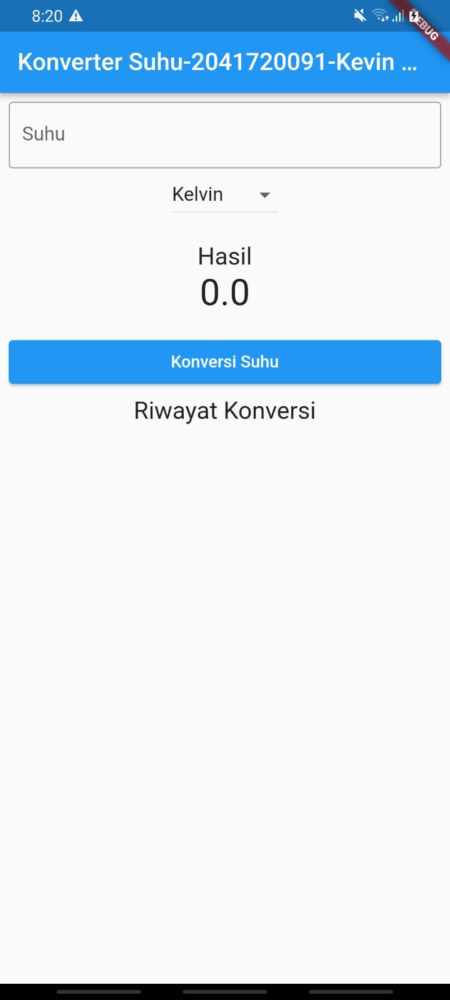
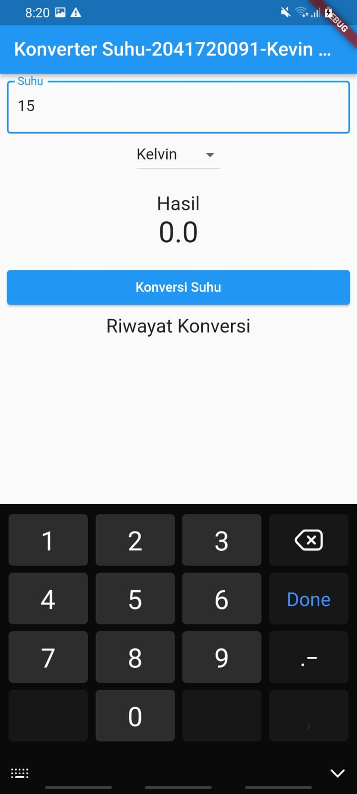
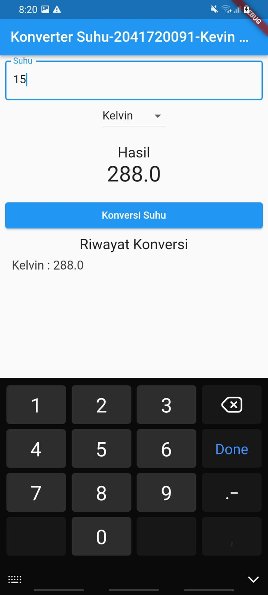
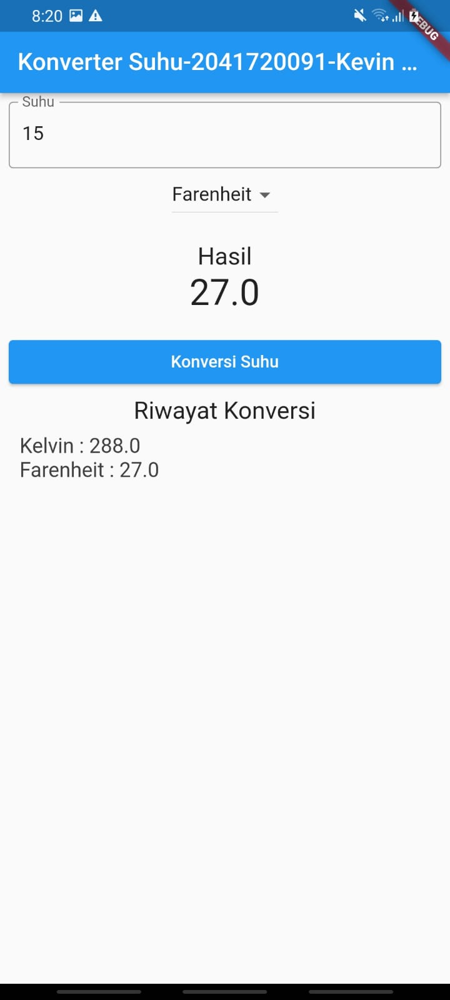
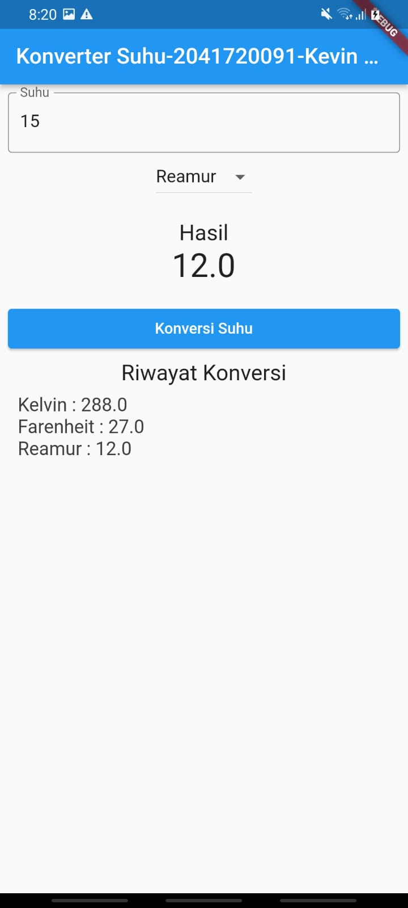
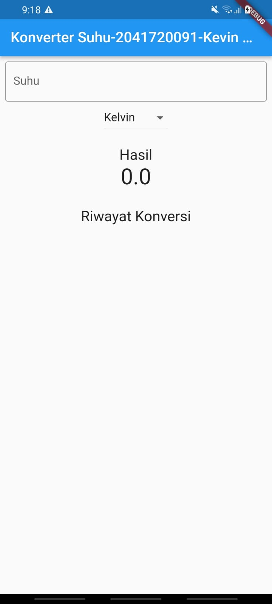
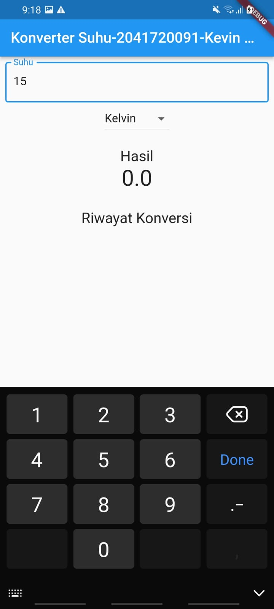
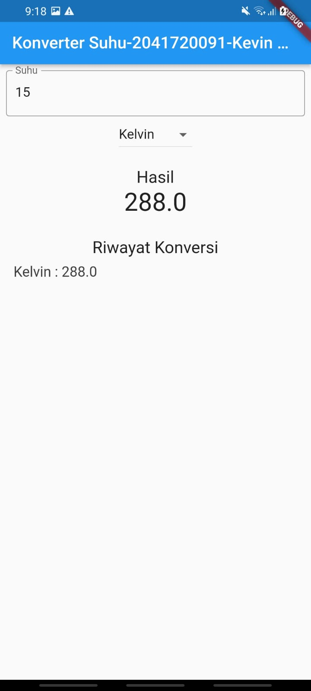
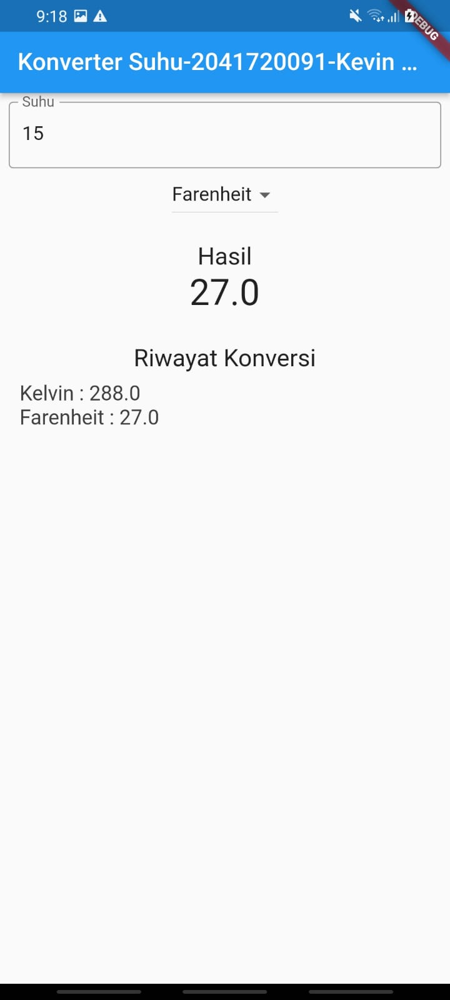

# konversi_suhu_listmap

Nama:Kevin Natanael Wijaya  
Kelas:TI-3B  
NIM:2041720091  
  
Tampilan Awal:  
  
Input Data:  
  
Konversi Kelvin:  
  
Konversi Farenheit:  
  
Konversi Reamur:  
  

## Tugas Konversi Tanpa Button  
  
Tampilan Awal:  
  
Input Data:  
  
Konversi Kelvin:  
  
Konversi Farenheit:  
  
Konversi Reamur:  
  
